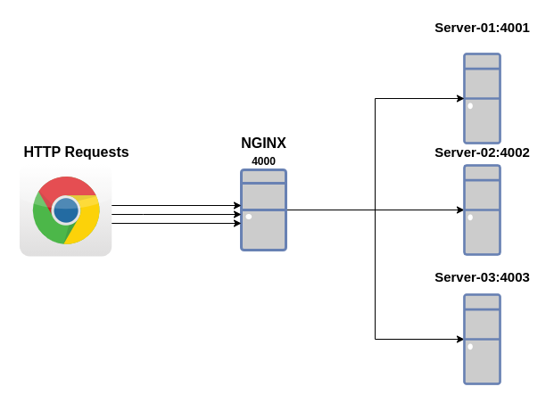

# NodeJS Load Balancer

Load balancing is an approach to distribute and allocate the ingress traffic to multiple application servers.

<p  align="center">
    
</p>

The load balancer stays in between the client and application servers and decides on which server this request should go. The decision can be configured using different algorithms.

- Round-robin (Default)
- Hash
- IP Hash
- Least connections

## NGINX Load balance methods (nginx.conf)

### Round Robin

```
upstream my_http_servers {
    server 127.0.0.1:4000;      # httpServer1 listens to port 4000
    server 127.0.0.1:4001;      # httpServer2 listens to port 4001
    server 127.0.0.1:4002;      # httpServer3 listens to port 4002
    server 127.0.0.1:4003;      # httpServer4 listens to port 4003
}
```

### Hash

```
upstream my_http_servers {
    hash $scheme$request_uri;
    server 127.0.0.1:4000;      # httpServer1 listens to port 4000
    server 127.0.0.1:4001;      # httpServer2 listens to port 4001
    server 127.0.0.1:4002;      # httpServer3 listens to port 4002
    server 127.0.0.1:4003;      # httpServer4 listens to port 4003
}
```

### IP Hash

```
upstream my_http_servers {
    ip_hash;
    server 127.0.0.1:4000;      # httpServer1 listens to port 4000
    server 127.0.0.1:4001;      # httpServer2 listens to port 4001
    server 127.0.0.1:4002;      # httpServer3 listens to port 4002
    server 127.0.0.1:4003;      # httpServer4 listens to port 4003
}
```

### Least connection

```
upstream my_http_servers {
    least_conn;
    server 127.0.0.1:4000;      # httpServer1 listens to port 4000
    server 127.0.0.1:4001;      # httpServer2 listens to port 4001
    server 127.0.0.1:4002;      # httpServer3 listens to port 4002
    server 127.0.0.1:4003;      # httpServer4 listens to port 4003
}
```
